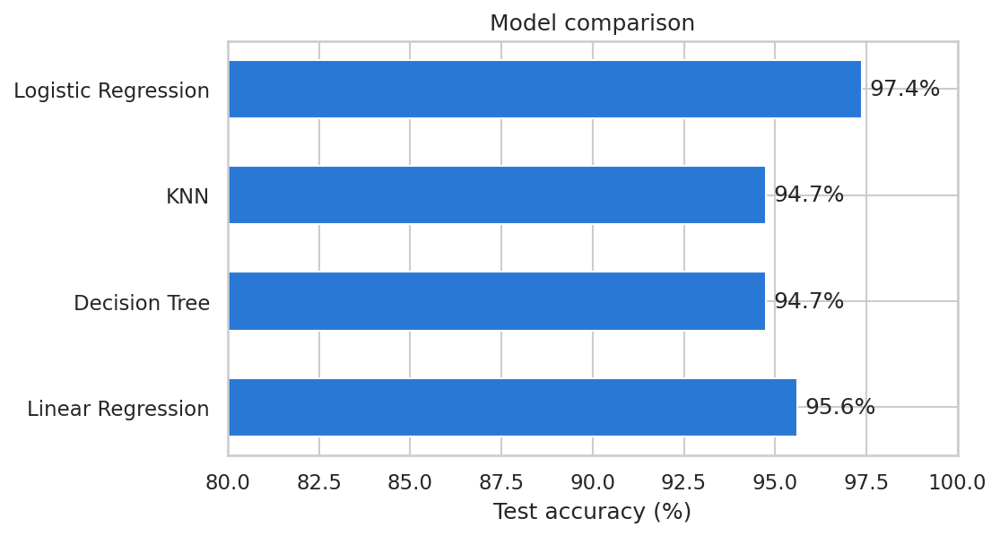
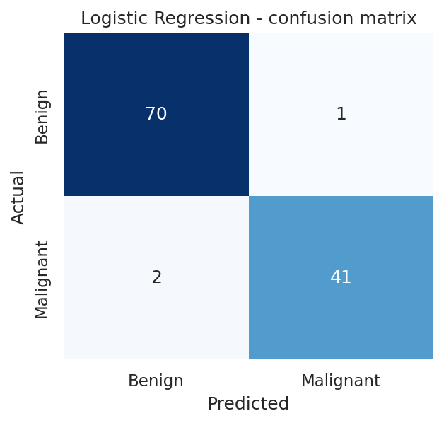
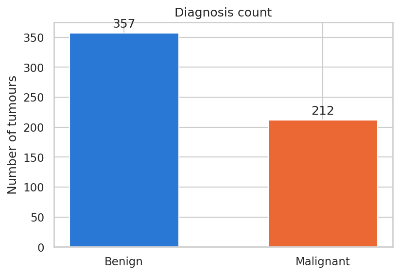
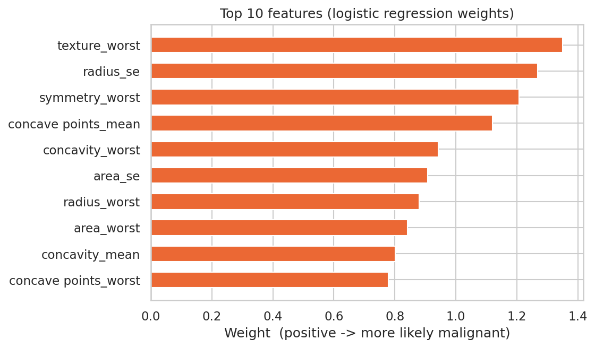
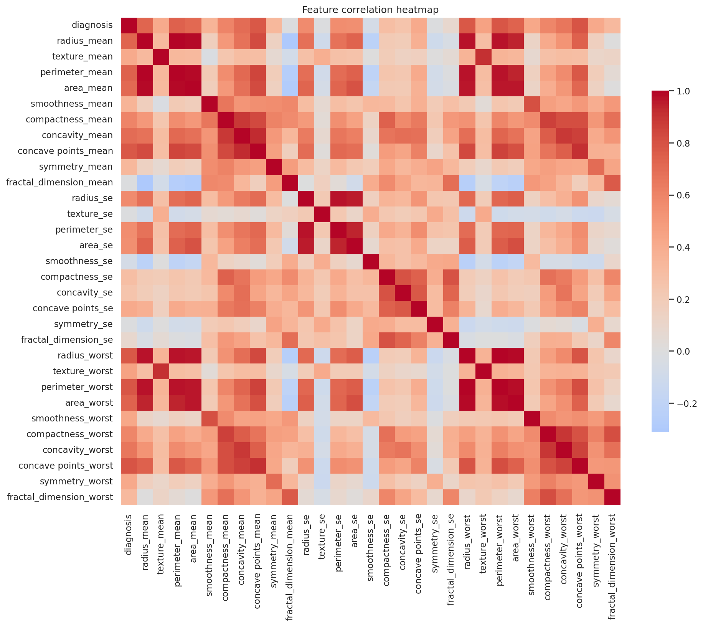
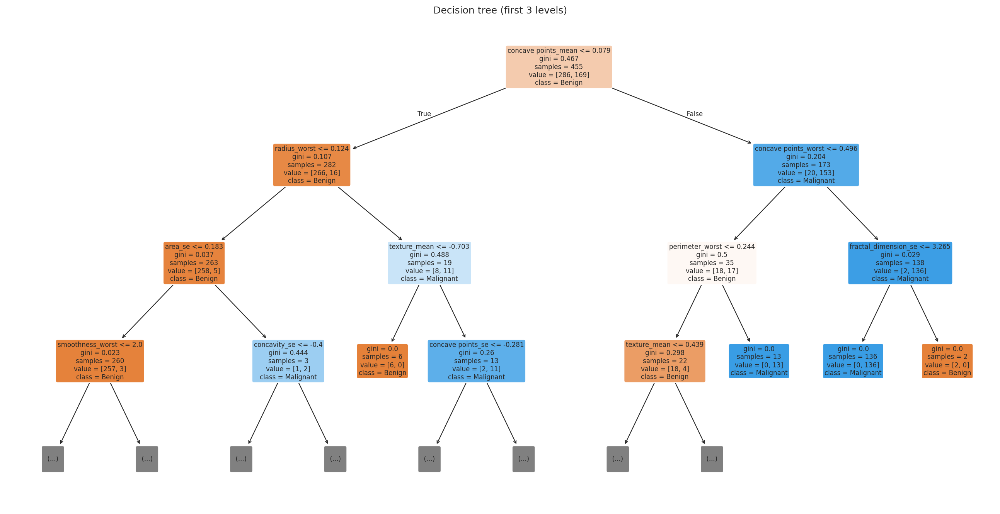

# Breast Cancer Prediction using Machine Learning

Classifying breast tumours as **Benign** or **Malignant** from 30 cell-nucleus measurements, and comparing four machine-learning models.

🌐 **Project website (with a live demo of the model):** https://aditi27003.github.io/Breast-Cancer-Prediction/

> ⚠️ **Educational project only.** This is a student machine-learning exercise on a public research dataset. It is not a medical device and must not be used for diagnosis.

---

## Results

Test set: 114 tumours (20% of the data) that the models never saw during training.

| Model | Accuracy | Precision | Recall | F1 |
|---|---:|---:|---:|---:|
| **Logistic Regression** | **97.4%** | **97.6%** | **95.3%** | **96.5%** |
| Linear Regression* | 95.6% | 97.5% | 90.7% | 94.0% |
| K-Nearest Neighbors (k=5) | 94.7% | 93.0% | 93.0% | 93.0% |
| Decision Tree | 94.7% | 93.0% | 93.0% | 93.0% |

Precision, recall and F1 are for the Malignant class. \*Linear Regression is included for comparison only: its numeric output is turned into a class with a 0.5 cut-off (R² = 0.727, MSE = 0.064).

**Best model: Logistic Regression.** It made only 3 mistakes out of 114 (1 benign tumour flagged as malignant, 2 malignant tumours missed).

<p align="center">
  
  
</p>

---

## Dataset

**Wisconsin Diagnostic Breast Cancer (WDBC)** – UCI Machine Learning Repository (also on Kaggle as `data.csv`).

- 569 tumours: 357 benign, 212 malignant
- 30 numeric features: the mean, standard error and "worst" (largest) value of 10 measurements of the cell nuclei: radius, texture, perimeter, area, smoothness, compactness, concavity, concave points, symmetry and fractal dimension
- No missing values

The file is included at [`data/data.csv`](data/data.csv) in the same column layout as the Kaggle version (the `id` column holds row numbers; it is dropped before training anyway).

<p align="center"></p>

---

## Approach

1. **Load & clean** – drop the `id` column and the empty `Unnamed: 32` column.
2. **Encode** – Malignant → 1, Benign → 0.
3. **Split** – 80% training / 20% test with `random_state=42` so results are reproducible.
4. **Scale** – `StandardScaler`, fitted on the training set only to prevent data leakage.
5. **Explore** – class distribution and feature correlation heatmap.
6. **Train & evaluate** – Logistic Regression, KNN, Decision Tree and Linear Regression, using accuracy, confusion matrix and classification report.
7. **Compare** the models.

### Most influential features

The features that push the Logistic Regression model most strongly towards "malignant":

<p align="center"></p>

### Correlation heatmap

Size measurements (radius, perimeter, area) are strongly correlated with each other.

<p align="center"></p>

### Decision tree (first 3 levels)

<p align="center"></p>

---

## How to Run

```bash
git clone https://github.com/aditi27003/Breast-Cancer-Prediction.git
cd Breast-Cancer-Prediction
pip install -r requirements.txt
python breast_cancer.py
```

The script prints each model's accuracy, confusion matrix and classification report, saves all charts to `images/`, and writes the metrics to `results.json`.

To refresh the model used by the website demo:

```bash
python export_model.py
```

---

## Project Structure

```
Breast-Cancer-Prediction/
├── breast_cancer.py     # Full analysis: cleaning, EDA, 4 models, comparison
├── export_model.py      # Exports the trained model for the website demo
├── data/
│   └── data.csv         # Wisconsin Diagnostic Breast Cancer dataset
├── images/              # Charts generated by breast_cancer.py
├── results.json         # Metrics from the latest run
├── model.json           # Model weights + test samples for the website demo
├── index.html           # Project website (GitHub Pages)
├── requirements.txt
└── README.md
```

---

## Tech Stack

Python · pandas · NumPy · scikit-learn · Matplotlib · Seaborn · HTML/CSS/JavaScript (website)

---

## Future Improvements

- Cross-validation instead of a single train/test split
- Hyperparameter tuning (e.g. best `k` for KNN, tree depth)
- More models: Random Forest, SVM, Gradient Boosting
- ROC curve and AUC
- Feature selection to reduce the 30 correlated features

---

## Author

**Aditi Srivastava**

Dataset: W.N. Street, W.H. Wolberg and O.L. Mangasarian, *Breast Cancer Wisconsin (Diagnostic)*, UCI Machine Learning Repository.
